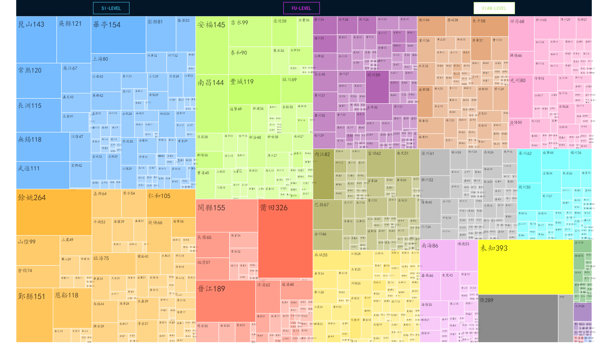

# Squarified Treemap
This code base uses squarified treemap to visualize the native place of Ming Jinshi. Here are four folders in this code base: Data, Report, Script and Treemap.

## Data
This folder contains the data used in the visualization process.

Xlsx file: ming_jinshilu_52y_release.xlsx (raw data)

JSON file: ming_jinshilu_52y_release.json, si_data.json, fu_data.json, xian_data.json (processed data)

## Report
This folder contains the course report (written in Latex).

## Script
This folder contains scripts for processing  raw data.

- data_process.py (read raw data and store the native places in it in JSON format)

- data_sort.py (sort JSON data using the value attribute)

- native_process.py (divide the native place data organized in JSON format according to administrative division level)

## Treemap
This folder is the main folder that implements the squarified treemap algorithm, it is organized as a standard HTML file, where the index.html file is the web page rendered for the final visualization result.

## Visualization
